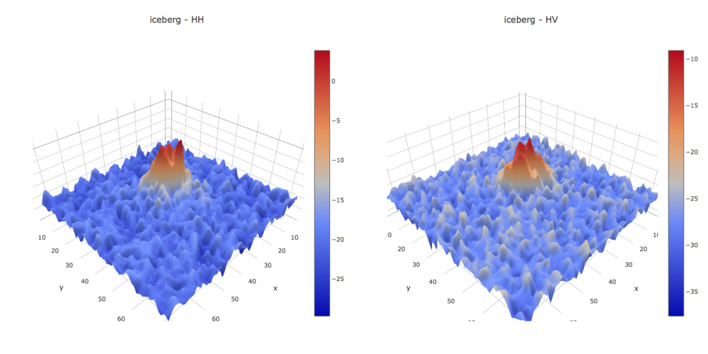
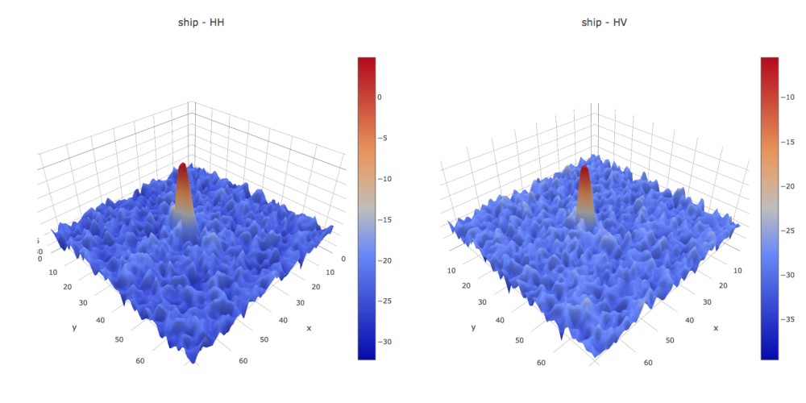
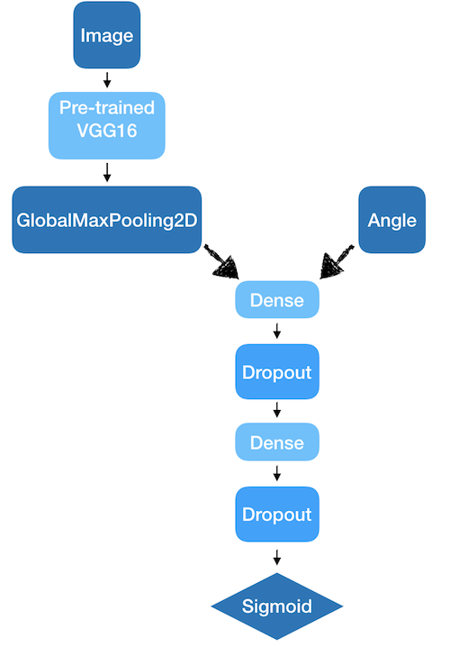
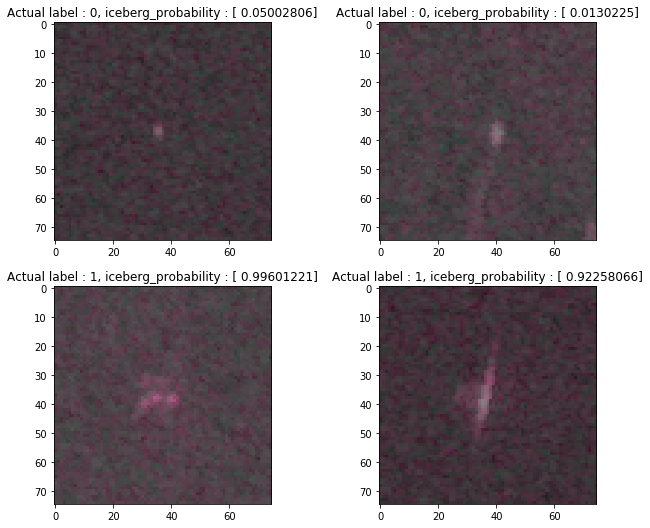

# MLND-Capstone-Project

## Iceberg Classifier

This is a repository for the capstone project going on in Udacity. The project received data from *Statoil/C-CORE Iceberg Classifier Challenge* at the [Kaggle Competitoin](https://www.kaggle.com/c/statoil-iceberg-classifier-challenge). The project goal is to distinguish between iceberg and ship from SAR image data from satellites. For this, deep learning will be conducted using CNN model.

### Software and Libraries

- Python 3.54
- Jupyter Notebook
- Tensorflow
- Keras
- Numpy
- Matplotlib

### Datasets

The datasets are hosted in a Kaggle competition. Please download data from the link provided.

This following link contains both train(train.json.7z) and test(test.json.7z) data. <https://www.kaggle.com/c/statoil-iceberg-classifier-challenge/data>

### 3D image samples for the training data

#### Iceberg

#### Ship

### iPython Notebooks

- Exploratory Visualization
  - 3D Images
    - [Model_00](https://github.com/jeongwhanchoi/MLND-Capstone-Project/blob/master/Model_00.ipynb)
  - Global Image Stats
    - [Explore_Image_Stats](https://github.com/jeongwhanchoi/MLND-Capstone-Project/blob/master/Explore_Image_Stats.ipynb)
  - Correlations Between Features
    - [Explore_Image_Stats](https://github.com/jeongwhanchoi/MLND-Capstone-Project/blob/master/Explore_Image_Stats.ipynb)
- Image Processing
  - [Sample_Images](https://github.com/jeongwhanchoi/MLND-Capstone-Project/blob/master/Sample_Images.ipynb)
- Benchmark CNN Model
  - [Model_00](https://github.com/jeongwhanchoi/MLND-Capstone-Project/blob/master/Model_00.ipynb)
- Improved CNN Model
  - [Model_01](https://github.com/jeongwhanchoi/MLND-Capstone-Project/blob/master/Model_01.ipynb)
- VGG16 CNN Model
  - K=3
    - [Model_03-SGD-k=3](https://github.com/jeongwhanchoi/MLND-Capstone-Project/blob/master/Model_03-SGD-k%3D3.ipynb)
  - K=5
    - [Model_03-SGD-k=5](https://github.com/jeongwhanchoi/MLND-Capstone-Project/blob/master/Model_03-SGD-k%3D5.ipynb)
  - K=7
    - [Model_03-SGD-k=7](https://github.com/jeongwhanchoi/MLND-Capstone-Project/blob/master/Model_03-SGD-k%3D7.ipynb)
  - K=10 (Final CNN Model)
    - [Model_03-SGD-k=10](https://github.com/jeongwhanchoi/MLND-Capstone-Project/blob/master/Model_03-SGD-k%3D10.ipynb)
- Other Optimizer of SGD
  - Adadelta
    - [Model_03-Adadelta-k=3](https://github.com/jeongwhanchoi/MLND-Capstone-Project/blob/master/Model_03-Adadelta-k%3D3.ipynb)

## Transfer Learning Model

## Example Results

